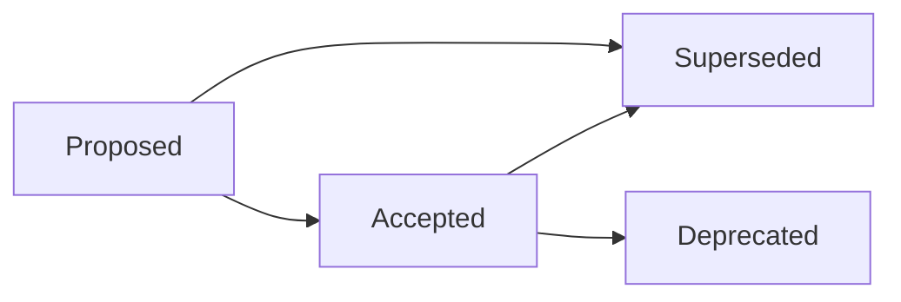

# ALiX Architecture Map

> **Purpose:** Navigate the architectural decision records, understand subsystem ownership, and find the right ADR before changing something.
>
> **Not a replacement for reading ADRs.** This map tells you *which* ADR to read for a given change. Read the ADR before making the change.

---

## ADR Index

| ADR | Domain | Key Decision |
|-----|--------|-------------|
| [0001](adrs/ADR-0001-hub-and-spoke-orchestration.md) | Orchestration | Central hub dispatches work to specialized spoke agents |
| [0002](adrs/ADR-0002-runtime-builder.md) | Runtime | Composable runtime construction via builder pattern |
| [0003](adrs/ADR-0003-balanced-local-model-decision.md) | Models | Local-first model strategy with tiered fallback |
| [0004](adrs/ADR-0004-protected-type-files.md) | Integrity | Structural protection for type definition files |
| [0005](adrs/ADR-0005-plan-scoped-snapshots.md) | Planning | Snapshots are immutable observations, not analytics |
| [0006](adrs/ADR-0006-a-series-governed-evolution-pipeline.md) | Evolution | Six-phase governed evolution pipeline (A0–A5) |
| [0007](adrs/ADR-0007-agent-subagent-execution-architecture.md) | Agents | Process-isolated subagents with structured I/O |
| [0008](adrs/ADR-0008-session-persistence-recovery.md) | Persistence | Append-first session model with deterministic resume |
| [0009](adrs/ADR-0009-security-integrity-audit.md) | Security | Multi-layer integrity: canonical hashing, audit, credentials |
| [0010](adrs/ADR-0010-executive-intelligence-architecture.md) | Intelligence | Cyclic executive stack: plan → evaluate → learn → recommend |
| [0011](adrs/ADR-0011-evolution-verification-model.md) | Verification | Counterfactual replay with dimensional confidence |
| [0012](adrs/ADR-0012-patch-mutation-architecture.md) | Patches | Preimage-validated patch engine with format selection |

---

## ADR Dependency Graph

```
ADR-0001  Hub-and-Spoke
    │
    ├──► ADR-0007  Agent/Subagent Model
    │       │
    │       ├──► ADR-0008  Session & Recovery
    │       │       │
    │       │       └──► ADR-0009  Security / Integrity / Audit
    │       │
    │       └──► ADR-0009
    │
    └──► ADR-0002  Runtime Builder
            │
            └──► ADR-0010  Executive Intelligence
                        │
                        ├──► ADR-0006  Governed Evolution Pipeline
                        │       │
                        │       ├──► ADR-0011  Verification Model
                        │       │
                        │       └──► ADR-0012  Patch & Mutation
                        │
                        └──► ADR-0009
```

Transitive dependencies are not expanded. If B depends on A, and C depends on B, C transitively depends on A — read A when changing C.

---

## Subsystem Ownership

| Subsystem | Path | ADRs | Maintains |
|-----------|------|------|-----------|
| Orchestration | `src/orchestrator/` | 0001 | Dispatch, coordination |
| Agents | `src/agents/`, `src/agent/` | 0001, 0007 | Subagent lifecycle, tool policy |
| Runtime | `src/runtime/` | 0002 | Builder, runtime composition |
| Session | `src/session/` | 0005, 0008 | Persistence, resume, checkpoints |
| Security & Audit | `src/security/`, `src/audit/` | 0004, 0009 | Canonical JSON, audit store, credentials, redaction |
| Governance | `src/gov/`, `src/governance/` | 0006 | CLI, evolution lifecycle |
| Evolution | `src/evolution/` | 0006, 0011 | A-series pipeline, verification, execution, observation |
| Executive | `src/executive/` | 0010 | Planning, outcome evaluation, learning, recommendations |
| Patches | `src/patch/` | 0012 | Edit format policy, preimage validation, rollback |
| CLI | `src/cli/` | — | Command tree, evolution subcommands |
| Tools | `src/tools/` | — | Tool execution, tool discovery |
| MCP | `src/mcp/` | — | MCP server integration |
| Providers | `src/providers/` | 0003, 0007 | Model provider interface, routing |
| Checkpoints | `src/checkpoints/` | 0005 | File-level checkpoints |
| Recovery | `src/recovery/` | 0008 | Crash recovery |

---

## Where to Look When Changing X

### Changing subagent dispatch or isolation

```
Read: ADR-0001, ADR-0007 (agent model)
Read: ADR-0009 (security boundaries)
Read: src/agents/subagent-manager.ts, src/agents/subagent-cli.ts
```

### Changing session persistence or resume

```
Read: ADR-0008 (session model)
Read: ADR-0005 (snapshots)
Read: src/session/persist.ts, src/session/resume.ts
```

### Changing evidence construction or integrity

```
Read: ADR-0006 (pipeline), ADR-0011 (verification model)
Read: ADR-0009 (integrity hashing)
Read: src/evolution/verification/contracts/verification-contract.ts
Read: src/security/audit/canonical-json.ts
```

### Changing governance decisions

```
Read: ADR-0006 (pipeline), ADR-0011 (verification model)
Read: src/evolution/governance/decision-engine.ts
Read: src/evolution/governance/decision-store.ts
```

### Changing mutation/editing behavior

```
Read: ADR-0012 (patch model)
Read: ADR-0005 (plan snapshots)
Read: ADR-0009 (path security)
Read: src/patch/patch-engine.ts, src/patch/preimage-validator.ts
```

### Changing the evolution pipeline

```
Read: ADR-0006 (pipeline), ADR-0011 (verification), ADR-0012 (patch)
Read: ADR-0009 (evidence integrity)
Read: src/evolution/contracts/evolution-contract.ts
Read: src/evolution/execution/, src/evolution/observation/
```

### Changing model selection or provider routing

```
Read: ADR-0003 (model strategy)
Read: ADR-0007 (role-to-model mapping)
Read: src/config/schema.ts (ModelTierConfig)
Read: src/providers/registry.ts
```

### Adding a new ADR

```
Read: docs/architecture/adrs/README.md (template)
Read: The ADRs most related to your change (use the dependency graph)
Create: docs/architecture/adrs/ADR-NNNN-title.md
Update: docs/architecture/adrs/README.md (index table)
```

---

## Invariants by Layer

### Orchestration Layer (ADR-0001, ADR-0007)

- Subagents never self-spawn — dispatch is centralized through SubagentManager
- Every subagent execution produces a structured JSONL transcript
- Worktrees provide isolation boundaries for write-mode agents
- Ownership registry prevents overlapping file ownership across agents

### Session Layer (ADR-0008)

- Messages are append-only — prior messages are never modified
- State snapshots are atomic — written as complete JSON files
- The session directory is the single source of truth for resume
- Session directories are self-contained — no cross-session references

### Integrity Layer (ADR-0009)

- Every evidence artifact has an integrity hash (SHA-256 + canonical JSON)
- Audit records are append-only — prior records are never modified
- Credentials are encrypted at rest
- Path traversal is structurally prevented

### Evolution Layer (ADR-0006, ADR-0011, ADR-0012)

- Governance depends on evidence, not implementation
- Execution never bypasses governance (requires APPROVE decision)
- Observation never mutates execution history
- Every forward step has a corresponding rollback step
- Every file mutation is preimage-validated before application

### Executive Layer (ADR-0010)

- The executive stack is advisory — recommendations enter the pipeline as proposals
- Learning is read-only — never mutates plans, evidence, or governance state
- Outcome evaluation triggers automatically but does not block the pipeline
- Recommendations carry provenance linking back to source trends

---

## Architecture Docs Reference

| Document | Location |
|----------|----------|
| ADR index (this file) | `docs/architecture/README.md` |
| ADRs | `docs/architecture/adrs/ADR-NNNN-*.md` |
| A-series living reference | `docs/architecture/a-series-governed-evolution.md` |
| Design specifications | `docs/architecture/specs/YYYY-MM-DD-*.md` |
| Implementation plans | `docs/superpowers/plans/YYYY-MM-DD-*.md` |

---

## ADR Lifecycle



| Status | Meaning |
|--------|---------|
| Proposed | Under review, not yet binding |
| Accepted | Active architectural decision — must be followed |
| Superseded | Replaced by a later ADR (linked in text) |
| Deprecated | No longer relevant, no replacement needed |
