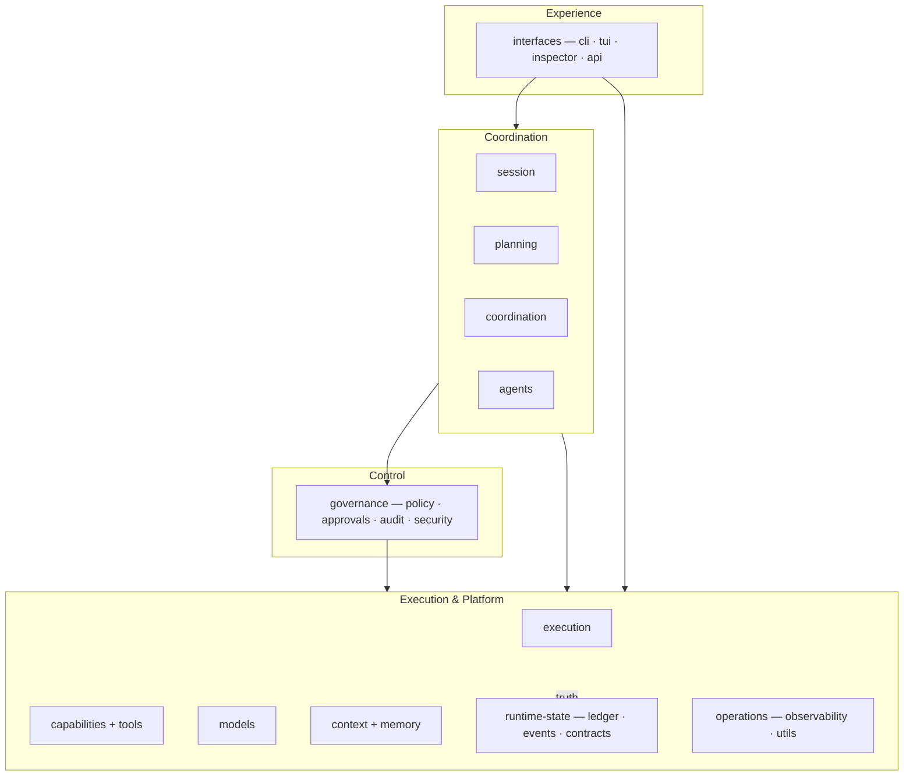

# ALiX Subsystem Architecture — Overview

> **Purpose:** the current shape of the system — the 12 subsystems, the 4 layers
> they sit in, the boundary each one owns, and the gates that keep the shape.
>
> **Status:** post-migration (R0–R6). Physical layout, boundaries, and authority
> consolidation are landed; this page describes the enforced present, not a plan.
> For *why* an individual decision was made, read the ADRs linked from
> [`README.md`](README.md). For the campaign history, see
> [`docs/refactors/r0-findings-r3-plan.md`](../refactors/r0-findings-r3-plan.md).

---

## Layered view

```
┌──────────────────────────── EXPERIENCE ─────────────────────────────┐
│  interfaces  (cli · tui · inspector/http · api)                     │
│  rule: command + display only — no business authority               │
└──────────────▲───────────────────────────────────┬──────────────────┘
   command     │                                   │ reads projections
               │                                   ▼
┌──────────────┴──────────── COORDINATION ────────────────────────────┐
│  session        planning         coordination        agents        │
│  turn lifecycle  proposes        schedules/plans      dispatches    │
│                                  graphs/workers                     │
└──────▲───────────────┬───────────────────────────────────▲─────────┘
  auth │               │ invokes / hands task              │ reads state
       │               ▼                                   │
┌──────┴──────────── CONTROL ──────────────┐                │
│  governance                              │                │
│  policy · approvals · audit · security   │                │
│  rule: authorizes — never executes       │                │
└──────▲───────────────┬───────────────────┘                │
  gate │               │ audit/ledger                       │
       │               ▼                                    │
┌──────┴─────────────── EXECUTION & PLATFORM ────────────────┴────────┐
│  execution            capabilities + tools        models            │
│  task loop            describe / implement        provider adapters  │
│                                                                     │
│  context + memory                 runtime-state                     │
│  informs, never overrides          ledger · events · contracts      │
│                                                                     │
│  operations                                                         │
│  observability (read-only) · shared utils                           │
└─────────────────────────────────────────────────────────────────────┘
```

`runtime-state` is the base truth: the R2 ledger is authoritative for flipped
domains, the event log records the rest, and the R1 contracts are the type-only
authority boundaries. Every layer above reads that truth or presents it — none
keeps a competing copy.

## Mermaid



## Subsystems

| Subsystem | Owns |
|---|---|
| `interfaces` | CLI, TUI, Inspector HTTP server + web UI, API routes — command and display only |
| `session` | Session lifecycle, persistence, recovery |
| `planning` | Proposals, decisions, adaptation/evolution |
| `coordination` | Graph execution, planning, scheduling, worker dispatch, ownership |
| `agents` | Built-in tool names/manifest, worker policy, subagent dispatch |
| `governance` | Policy, approvals, audit, security (authorization authority) |
| `execution` | Task loop, verification, patch, executive/adaptation runtime |
| `capabilities` | Tool surface, skills, MCP — describe vs implement |
| `models` | Provider adapters, routing, tracing |
| `context` | Repo map, context compiler, memory |
| `runtime-state` | Ledger, events, storage, R1 contracts (truth) |
| `operations` | Observability, daemon, schedules, evals, shared utils |

## Boundaries (enforced)

| Layer | Contract |
|---|---|
| interfaces | command + display only |
| planning | proposes |
| governance | authorizes (never executes) |
| coordination | owns scheduling (`CoordinationScheduler`), graph, worker dispatch |
| execution | acts (task loop) |
| capabilities/tools | describe vs implement |
| runtime-state | records truth (ledger); projections present |
| context/memory | informs, never overrides |
| operations | measures, controls nothing |

## Single-owner authorities

Each responsibility has exactly one authoritative definition (verified):

- **Policy / authorization:** `PolicyGate` + `ExecutionAuthorization` (`evaluateRuntimeGate` adapts graph nodes to the one boundary).
- **Approvals:** `ApprovalStore` (`loadApprovalStore`).
- **Ownership:** `OwnershipRegistry` + one matcher `isWithinOwnedScope` (claim overlap shares the same primitives).
- **Liveness:** `shouldReclaimWorker` — the ONE reclaim verdict.
- **Completion:** `createCompletionService` (one assembly) + `deriveRunCompletion` (one derivation).
- **Scheduling:** `createCoordinationScheduler` (the only construction seam).
- **Tools:** `ToolRegistry` implementing `createToolCapabilityRegistry`; `ToolExecutor` built only via `createToolExecutor`.
- **Models:** `createModelResolver` (canonical `models.*` reader); `resolveEffectiveModel` for subagent tiers.
- **Truth:** `getSharedLedger` / `RuntimeLedger`; the append-is-commit contract.
- **Containment:** `relativeIsOutside` — the one lexical path predicate (backed by `WorkspacePathResolver`).

## Enforcement

- `tests/architecture/r1-boundary-freeze.test.ts` — pins imports of protected files; `r1-allowlist.json` is shrink-only (R0 ref + removal phase).
- `tests/architecture/layer-boundaries.test.ts` — pins the direction of value imports between the 12 subsystems (static `import`/`export … from` and dynamic `import()`; type-only forms exempt); `layer-allowlist.json` is shrink-only.
- `tests/architecture/r15-authorization.test.ts` — R1.5 authorization containment.
- Zero import cycles (tooling: `gitnexus check --cycles`).

## Verification

```bash
pnpm build
pnpm typecheck && pnpm typecheck:unused
node scripts/check-dead-modules.mjs     # no importer-less src modules
node scripts/check-dox-claims.mjs --base origin/main
pnpm test:node && pnpm test:vitest
```
